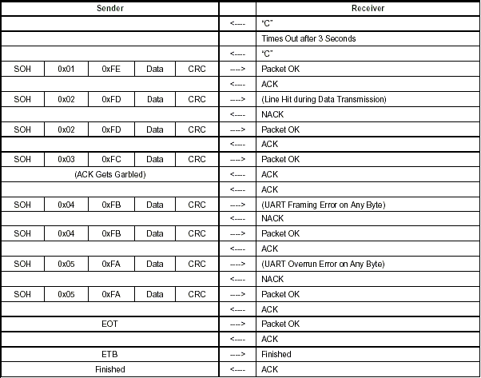

# STM32 Bootloader XModem

Der Bootloader verwendet das XModem Protocoll zur Übertragung des neuen Application Quellcodes.
Dafür wird auf einem UART die serielle Schnittstelle zur Verfügung gestellt. Mit einem Programm,
welches den XModem-Transfer unterstützt, z.B. TeraTerm, kann dann eine neue Application auf
den Mikrocontroller aufgespielt werden.

## Aktuell unterstützt

Folgende Mikrocontroller werden vom Bootloader unterstützt, dabei wird jedoch nur Bank1 verwendet.
Ebenfalls wird nicht bei jedem Mikrocontroller der gesamte Speicher der zur Verfügung steht
genutzt. 

| µC | Startadresse | Endadresse | Bank | Speicher | Bootloader | Application |
|:-- |:------------ |:---------- |:---- |:--------:|:----------:|:-----------:|
| F105 | 0x08008000 | 0x0803FFFF | Bank1 | 256kB | 32kB | 224kB |
| F767 | 0x08008000 | 0x0800FFFF | Bank1 | 2048kB | 32kB | 32kB |
| G071 | 0x08008000 | 0x0801FFFF | Bank1 | 128kB | 32kB | 96kB |
| H743 | 0x08020000 | 0x0803FFFF | Bank1 | 2048kB | 128kB | 128kB |

Standardmäßig werden die Start- und Endadresse im Programm gesetzt. Diese Werte können aber
jeweils im eigenen Programmcode vordefiniert werden. Dabei können dann drei defines gesetzt werden.

	- FLASH_APP_START_ADDRESS	: Gibt die Startadresse der Application an
	- FLASH_APP_END_ADDRESS		: Setzt die Endadresse der Application
	- FLASH_APP_VALID_ADDRESS	: Wird benötigt, um eine vorhanden App zu erkennen

## Application

Bei der Application muss dann in der STM32xxx_Flash.ld noch die folgende Zeile angepasst werden.
Hier muss ebenfalls die Startadresse der Application eingetragen werden. So ist hier die
Standardadresse 0x8000000 zu tauschen. Dabei muss der neue Wert ein vielfaches von 0x200 sein.

```C
FLASH		(rx)	: ORIGIN = 0x8000000,	LENGTH = 96K
```

Die Länge hängt hierbei von der Größe des Speichers sowie der Startadresse ab. Unterschiedliche
Mikrocontroller haben eine unterschiedliche Größe. Je nach Startadresse wird der noch zur
Verfügung stehende Speicher ebenfalls kleiner.

Eine weitere Anpassung ist in der system_stm32xxx.c notwendig. Hier muss die Vector-Tabelle
angepasst werden. Zudem muss sie aktiviert sein. Dafür wird nach dem Kommentar

```C
#define USER_VECT_TAB_ADDRESS
```

gesucht und die Kommentierung aufgehoben. Direkt darunter muss dann noch das Offset festgelegt
werden. Das Offset hängt von der Startadresse ab. Die folgende Zeile ist nur exemplarisch und
setzt mit dem gezeigten Offset die Startadresse der neuen Vectortabelle auf 0x08008000.

```C
#define VECT_TAB_OFFSET         0x00008000U
```

## Verwendung

Die Nutzung der Bibliothek für den XModem-Bootloader bnötigt nur folgende drei Schritte. Sie muss
im Projekt eingebunden werden, damit der Compiler weiß, wo er die Daten findet. Dann muss im
Programm der Header-File

```C
#include "Xmodem.h"
```

eingebunden werden. Dies passiert am besten in der main.c. Als letztes wird dann in der
main-Funktion noch die Funktion

```C
xmodem_receive();
```

aufgerufen. Für eine endlose Schleife muss dies in der while(1) passieren. Diese prüft, ob auf
dem Mikrocontroller schon eine Application vorhanden ist. Sollte dies der Fall sein, springt sie
automatisch nach einem Timeout von ca. 100s in die Application. Wird keine Application gefunden,
wartet die Funktion dauerhaft auf einen upload.

---

## Einführung [English](#introduction)

Das Xmodem-Protokoll wurde vor Jahren entwickelt, um die Kommunikation zwischen zwei Computern
zu vereinfachen. Dank seines Halbduplex-Betriebs, 128-Byte-Paketen, ACK/NACK-Antworten und
CRC-Datenprüfung hat das Xmodem-Protokoll Einzug in viele Anwendungen gehalten. Tatsächlich
verfügen die meisten modernen PC-Kommunikationspakete über ein Xmodem-Protokoll.


## Funktionstheorie

Xmodem ist ein Halbduplex-Kommunikationsprotokoll. Der Empfänger bestätigt nach dem Empfang eines
Pakets dieses entweder (ACK) oder nicht (NAK). Die CRC-Erweiterung des ursprünglichen Protokolls
verwendet einen robusteren 16-Bit-CRC zur Validierung des Datenblocks und wird hier verwendet.
Xmodem ist empfängergesteuert. Das heißt, der Empfänger sendet ein „C“ an den Sender, um seine
Empfangsbereitschaft im CRC-Modus anzuzeigen. Der Sender sendet dann ein 133 Byte langes Paket.
Der Empfänger validiert es und antwortet mit einem ACK oder NAK. Anschließend sendet der Sender
entweder das nächste Paket oder das letzte Paket erneut. Dieser Vorgang wird fortgesetzt, bis der
Empfänger ein EOT empfängt und es dem Sender ordnungsgemäß bestätigt. Nach dem ersten Handshake
steuert der Empfänger den Datenfluss durch ACK und NAK an den Sender.

| Byte 1 | Byte 2 | Byte 3 | Byte 4 - 131 | Byte 132 - 133 |
|:------ |:------ |:------ |:------------ |:-------------- |
| Start of Header | Packet Number | (Packet Number) | Packet Data | 16-bit CRC |

Tabelle 1. XmodemCRC Paketformat

## Definitions

Die folgenden Definitionen werden für die Protokollflusssteuerung verwendet.

| Symbol | Description | Value |
|:------ |:----------- |:-----:|
| SOH | Start of Header | 0x01 |
| EOT | End of Transmission | 0x04 |
| ACK | Acknowledge | 0x06 |
| NAK | Not Acknowledge | 0x15 |
| ETB | End of Transmission Block (Return to Amulet OS mode) | 0x17 |
| CAN | Cancel (Force receiver to start sending C's) | 0x18 |
| C | ASCII “C” | 0x43 |

Byte 1 des XmodemCRC-Pakets kann nur die Werte SOH, EOT, CAN oder ETB annehmen. Alles andere ist
ein Fehler. Bytes 2 und 3 bilden eine Paketnummer mit Prüfsumme. Addiert man die beiden Bytes, ergibt
sich immer 0xff. Bitte beachten Sie, dass die Paketnummer bei 1 beginnt und auf 0 zurückgesetzt wird,
wenn mehr als 255 Pakete empfangen werden. Die Bytes 4–131 bilden das Datenpaket und können beliebig
sein. Die Bytes 132 und 133 bilden den 16-Bit-CRC. Das High-Byte des CRC befindet sich in Byte 132.
Der CRC wird nur anhand der Datenpaketbytes (4–131) berechnet.

## Synchronisation

Der Empfänger sendet zunächst ein ASCII-Zeichen „C“ (0x43) an den Sender, um die Verwendung der
CRC-Blockvalidierung zu signalisieren. Nach dem Senden des ersten „C“ wartet der Empfänger entweder
auf eine 3-sekündige Zeitüberschreitung oder bis ein Puffer-voll-Flag gesetzt wird. Tritt eine
Zeitüberschreitung beim Empfänger auf, wird ein weiteres „C“ an den Sender gesendet, und die 3-sekündige
Zeitüberschreitung beginnt erneut. Dieser Vorgang wird fortgesetzt, bis der Empfänger ein vollständiges
133-Byte-Paket empfängt.

## Hinweise zum Empfänger

Dieses Protokoll erkennt folgende Bedingungen: 1. Framing-Fehler bei einem beliebigen Byte, 2.
Überlauffehler bei einem beliebigen Byte, 3. Doppeltes Paket, 4. CRC-Fehler, 5. Zeitüberschreitung
beim Empfänger (Paket nicht innerhalb von 1 Sekunde empfangen). Bei jeder NAK sendet der Sender das
letzte Paket erneut. Die Punkte 1 und 2 sind als schwerwiegende Hardwarefehler zu betrachten. Stellen
Sie sicher, dass Sender und Empfänger dieselbe Baudrate sowie dieselben Start- und Stoppbits verwenden.
Punkt 3 besteht normalerweise darin, dass der Sender ein verstümmeltes ACK erhält und das Paket erneut
sendet. Punkt 4 tritt in lauten Umgebungen auf. Und das letzte Problem sollte sich selbst korrigieren,
nachdem der Empfänger dem Sender ein NAK erteilt hat.



---

## Introduction

The Xmodem protocol was created years ago as a simple means of having two computers talk to each other.
With its half-duplex mode of operation, 128- byte packets, ACK/NACK responses and CRC data checking,
the Xmodem protocol has found its way into many applications. In fact most communication packages
found on the PC today have a Xmodem protocol available to the user.

## Theory of Operation

Xmodem is a half-duplex communication protocol. The receiver, after receiving a packet, will either
acknowledge (ACK) or not acknowledge (NAK) the packet. The CRC extension to the original protocol uses
a more robust 16-bit CRC to validate the data block and is used here. Xmodem can be considered to be
receiver driven. That is, the receiver sends an initial character “C” to the sender indicating that
it’s ready to receive data in CRC mode. The sender then sends a 133-byte packet, the receiver validates
it and responds with an ACK or a NAK at which time the sender will either send the next packet or
re-send the last packet. This process is continued until an EOT is received at the receiver side and
is properly ACKed to the sender. After the initial handshake the receiver controls the flow of data
through ACKing and NAKing the sender.

| Byte 1 | Byte 2 | Byte 3 | Byte 4 - 131 | Byte 132 - 133 |
|:------ |:------ |:------ |:------------ |:-------------- |
| Start of Header | Packet Number | (Packet Number) | Packet Data | 16-bit CRC |

Table 1. XmodemCRC Packet Format

## Definitions

The following defines are used for protocol flow control.

| Symbol | Description | Value |
|:------ |:----------- |:-----:|
| SOH | Start of Header | 0x01 |
| EOT | End of Transmission | 0x04 |
| ACK | Acknowledge | 0x06 |
| NAK | Not Acknowledge | 0x15 |
| ETB | End of Transmission Block (Return to Amulet OS mode) | 0x17 |
| CAN | Cancel (Force receiver to start sending C's) | 0x18 |
| C | ASCII “C” | 0x43 |

Byte 1 of the XmodemCRC packet can only have a value of SOH, EOT, CAN or ETB anything else is an error.
Bytes 2 and 3 form a packet number with checksum, add the two bytes together and they should always equal
0xff. Please note that the packet number starts out at 1 and rolls over to 0 if there are more than 255
packets to be received. Bytes 4 - 131 form the data packet and can be anything. Bytes 132 and 133 form
the 16-bit CRC. The high byte of the CRC is located in byte 132. The CRC is calculated only on the data
packet bytes (4 - 131).

## Synchronization

The receiver starts by sending an ASCII “C” (0x43) character to the sender indicating it wishes to use the
CRC method of block validating. After sending the initial “C” the receiver waits for either a 3 second
time out or until a buffer full flag is set. If the receiver is timed out then another “C” is sent to the
sender and the 3 second time out starts again. This process continues until the receiver receives a
complete 133-byte packet.

## Receiver Considerations

This protocol NAKs the following conditions:
	1. Framing error on any byte
	2. Overrun error on any byte
	3. Duplicate packet
	4. CRC error
	5. Receiver timed out (didn't receive packet within 1 second)
On any NAK, the sender will re-transmit the last packet. Items 1 and 2 should be considered serious
hardware failures. Verify that sender and receiver are using the samebaud rate, start bits and stop bits.
Item 3 is usually the sender getting an ACK garbled and re-transmitting the packet. Item 4 is found in noisy
environments. And the last issue should be self-correcting after the receiver NAKs the sender.


---

## Sample crc calculation code

```c
int calcrc(char *ptr, int count)
{
    int  crc;
    char i;

    crc = 0;
    while (--count >= 0)
    {
        crc = crc ^ (int) *ptr++ << 8;
        i = 8;
        do
        {
            if (crc & 0x8000)
                crc = crc << 1 ^ 0x1021;
            else
                crc = crc << 1;
        } while(--i);
    }
    return (crc);
}
```